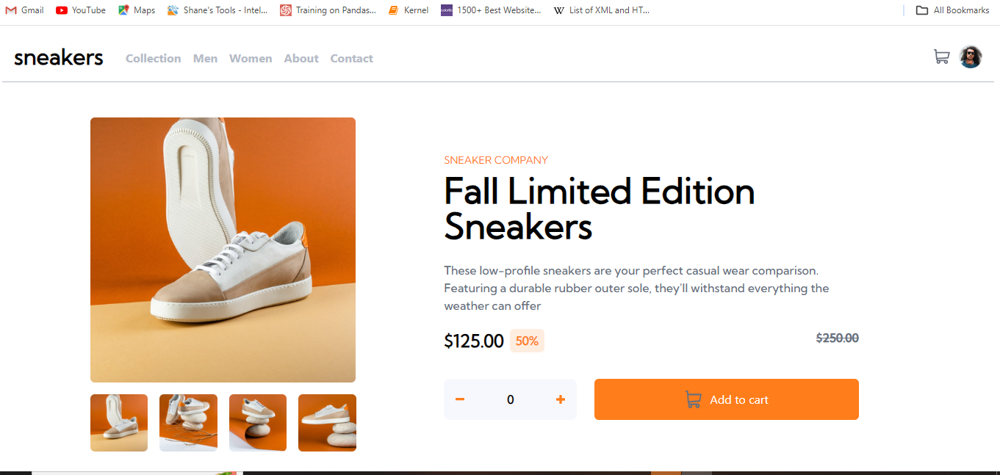

# Frontend Mentor - E-commerce product page solution

This is a solution to the [E-commerce product page challenge on Frontend Mentor](https://www.frontendmentor.io/challenges/ecommerce-product-page-UPsZ9MJp6). Frontend Mentor challenges help you improve your coding skills by building realistic projects.

## Table of contents

- [Overview](#overview)
  - [The challenge](#the-challenge)
  - [Screenshot](#screenshot)
  - [Links](#links)
- [My process](#my-process)
  - [Built with](#built-with)
  - [What I learned](#what-i-learned)
  - [Continued development](#continued-development)
- [Author](#author)

## Overview

This project is a web app that allows users to add a product to a cartlist and also delete their product from the cartlist

### The challenge

Users should be able to:

- View the optimal layout for the site depending on their device's screen size
- See hover states for all interactive elements on the page
- Open a lightbox gallery by clicking on the large product image on a desktop version
- Switch the large product image by clicking on the small thumbnail images
- Add items to the cart
- View the cart and remove items from it

### Screenshot

### Links

<!-- - Solution URL: [Add solution URL here](https://your-solution-url.com)
- Live Site URL: [Add live site URL here](https://your-live-site-url.com) -->

## My process

I Started this project working with the mobile version first. Throughout the project a major logic that affected a lot of the function was an index called mainImageNo basically every Image has a mainImageNo associated with it and then the mainImageNo was just manipulated to change the large image
Another key logical variable was the orderNo which is a list of 4 numbers which are manipulated to add products to the cartlist. Tailwindss Styling was also used during the project with little custom css stylesheet

### Built with

- Semantic HTML5 markup
- CSS custom properties
- Flexbox
- Mobile-first workflow
- [React](https://reactjs.org/) - JS library
- Tailwindcss
- Typescript

### What I learned

Some of the things i learnt via this project was
i. how to spread a state which is a list for easy update
ii. how to implement a function for only a particular screen size
iii. replacingn particular element at specific index

### Continued development

As i begin to go into backend development. I believe this project can be furthered in the backend such that on clicking checkout another page reloads and a server detects the products that have been selected

## Author

- Website - [https://portfolio-7t2.pages.dev/]
- Name - [Omilani Michael Olugbenga]
- Frontend Mentor - [@MICHAEL10000000](https://www.frontendmentor.io/profile/MICHAEL10000000)
- Twitter - [@GbengaOmilani](https://www.twitter.com/GbengaOmilani)
